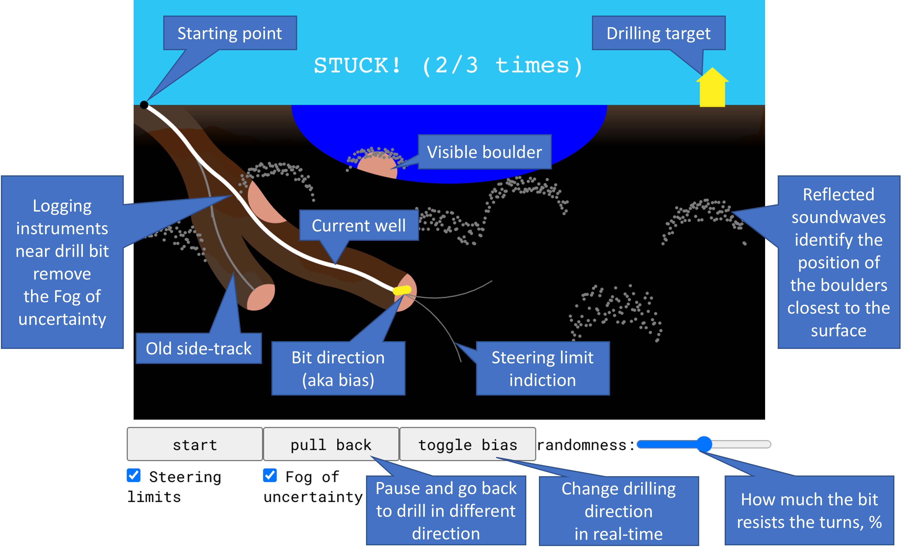

# Horizontal Directional Drilling Simulation

## Help wanted!

Dear contributors, please look into [houses-feature](https://github.com/CodingTrain/Directional-Boring/tree/houses-feature) branch where we try to make better more fun graphics and the corresponding issues: [46](https://github.com/CodingTrain/Directional-Boring/issues/46), 
[41](https://github.com/CodingTrain/Directional-Boring/issues/41). 
Thanks to [amnindersingh12](https://github.com/amnindersingh12) for starting the work on this feature!

## Original concept description

Coding walkthrough and references: [thecodingtrain.com/challenges/172-directional-boring](https://thecodingtrain.com/challenges/172-directional-boring)

This project started as a collaboration with [Grady Hillhouse](https://practical.engineering/) at the [Practical Engineering YouTube channel](https://www.youtube.com/channel/UCMOqf8ab-42UUQIdVoKwjlQ). [Check out his video to learn more about horizontal directional drilling](https://youtu.be/JAhdb7dKQpU)!

Give the Coding Train version a try [codingtrain.github.io/Directional-Boring](https://codingtrain.github.io/Directional-Boring)

## Fog of uncertainty only penetrated by sound waves to detect boulders

This version is a playable simulation game. You need to reach the target and not hit any obstacles. You only control the bit's **bias** (direction), either up or down. 

The Fog of uncertainty hides the large boulders. The fog clears away as you drill closer. To help you out, the tops of the boulders are detected before drilling by reflected sound waves shot from the surface; see [Reflection seismology](https://en.wikipedia.org/wiki/Reflection_seismology).

If you hit a boulder, you can **pull back** the pipe (several times) and try drilling in another direction. Your drill bit will get broken after three collisions. 

The score shows the total length drilled, the final length of the well and the number of times you got stuck. 

Give the alin256 version a try [al-digital.no/Directional-Boring](https://al-digital.no/Directional-Boring)

## DOI for citing one of the latest releases:

Copyright (c) 2022 Daniel Shiffman; Sergey Alyaev (alin256); ArztKlein; Rishi; tyomka896 <a href="LICENSE.md">MIT License</a>
