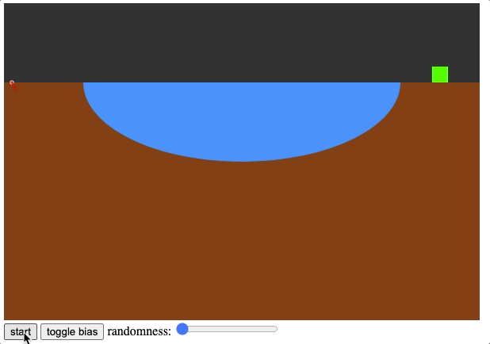

# Horizontal Directional Drilling Simulation

Coding walkthrough and references: [thecodingtrain.com/challenges/172-directional-boring](https://thecodingtrain.com/challenges/172-directional-boring)

This project is a collaboration with [Grady Hillhouse](https://practical.engineering/) at the [Practical Engineering YouTube channel](https://www.youtube.com/channel/UCMOqf8ab-42UUQIdVoKwjlQ). [Check out his video to learn more about horizontal directional drilling](https://youtu.be/JAhdb7dKQpU)!

Give it a try at [codingtrain.github.io/Directional-Boring](https://codingtrain.github.io/Directional-Boring)

